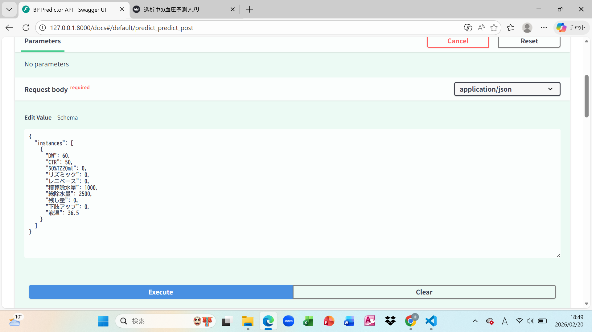
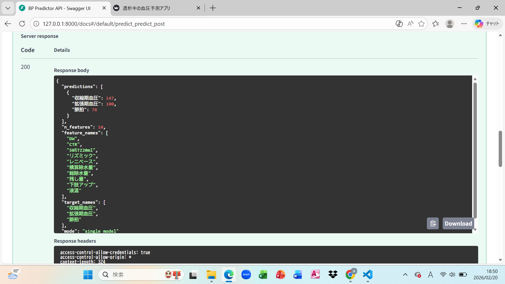
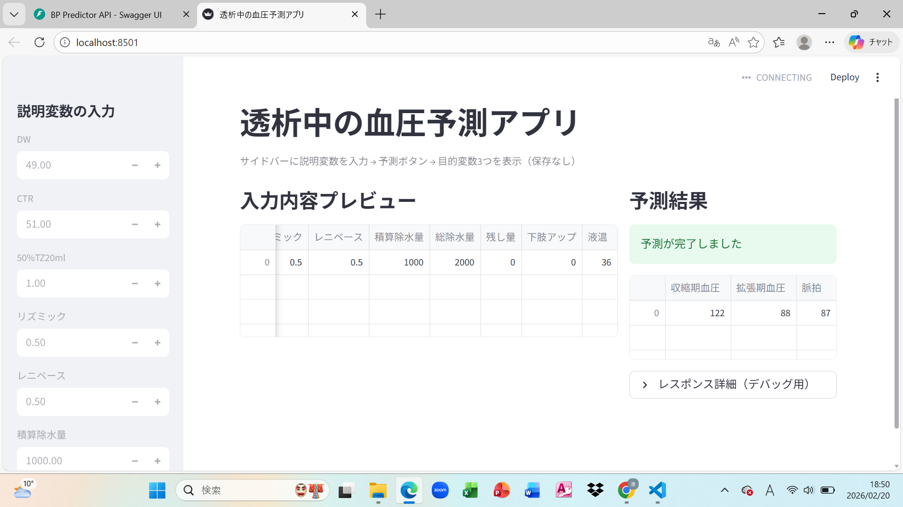

# 透析中の血圧予測 AI モデル & 推論アプリ

透析中のパラメータ（除水量・体重変化・液温など）から  
**収縮期血圧・拡張期血圧・脈拍**を推定する多出力回帰モデルと、  
FastAPI + Streamlit による推論アプリケーションです。

---

## 🎯 このプロジェクトで実装したこと

- 医療データの前処理設計（train/val/test分割）
- StandardScalerによる入力・出力の標準化
- PyTorchによる多出力回帰モデルの学習
- 学習済みモデルとスケーラーの保存（artifacts管理）
- FastAPIによる推論API化
- StreamlitによるUI実装
- モデル評価と課題分析

---

## 🏗 システム構成

Colab（学習）

↓

artifacts保存（model.pth / scaler_x.pkl / scaler_t.pkl）

↓

FastAPI（推論API）

↓  

Streamlit（UI）

---

## 🖥 デモ画面

### FastAPI 



### FastAPI2

]

### Streamlit UI



---

## 🚀 ローカル実行方法

1. 仮想環境作成

```bash
python -m venv venv
venv\Scripts\activate
```
2. 依存関係インストール

```bash
pip install -r requirements.txt
```
3. FastAPI起動

```bash
uvicorn api:app --host 127.0.0.1 --port 8000
```
Swagger UI:

```bash
http://127.0.0.1:8000/docs
```
4. Streamlit起動

```bash
streamlit run app.py
```
UI

```bash
http://localhost:8501
```

---

## 🔌 API 使用例

🔌 API 使用例

```bash
{
  "instances": [
    {
      "DW": 60,
      "CTR": 50,
      "50%TZ20ml": 0,
      "リズミック": 0,
      "レニベース": 0,
      "積算除水量": 1000,
      "総除水量": 2500,
      "残し量": 0,
      "下肢アップ": 0,
      "液温": 36.5
    }
  ]
}
```

---

## 🧠 モデル仕様

入力特徴量（10項目）

- DW
- CTR
- 50%TZ20ml
- リズミック
- レニベース
- 積算除水量
- 総除水量
- 残し量
- 下肢アップ
- 液温

出力

- 収縮期血圧
- 拡張期血圧
- 脈拍

データ分割

- Train: 285
- Validation: 95
- Test: 95

前処理

- StandardScaler（入力）
- StandardScaler（出力）

モデル構造

- Linear(64) → BatchNorm → Dropout
- Linear(32) → BatchNorm → Dropout
- Linear(3)

---

## 📊 テストデータ評価結果（元スケール）

| 指標   | 収縮期血圧      | 拡張期血圧      | 脈拍       |
| ---- | ---------- | ---------- | -------- |
| RMSE | 27.85 mmHg | 14.17 mmHg | 3.35 bpm |
| MAE  | 22.77 mmHg | 11.55 mmHg | 2.72 bpm |
| R²   | -0.086     | -0.080     | -0.012   |

---

## 現状の課題

- R²が負値 → 平均予測を上回る性能には未到達
- データ数が少ない（数百例）
- 血圧変動は多因子性であり、追加臨床情報が必要

---

## 注意事項

本プロジェクトは研究・検証目的です。
臨床判断の代替を目的とするものではありません。

---
